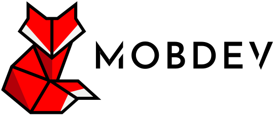

# MOBDEV Front Challenge

Proyecto construido con [Next.js](https://nextjs.org/) y [`create-next-app`](https://github.com/vercel/next.js/tree/canary/packages/create-next-app).

---

<br>
<br>

## Estructura de proyecto

```sh
├── README.md
├── package.json
├── public
│   └── favicon.ico
├── src
│   ├── components
│   │   └── ExampleComponent
|   |       ├── ExampleComponent.tsx
|   |       ├── ExampleComponent.module.scss
│   │       └── index.tsx
│   ├── pages
│   │   ├── _app_.tsx
│   │   ├── _document.tsx
│   │   └── index.tsx
│   ├── styles
│   │   └── global.scss
│   ├── services
│   │   └── breeds.ts
│   ├── types
│   │   └── breeds.ts
│   └── utils
│       └── assets.ts
│       └── constants.ts
│       └── format.ts
│       └── ids.ts
│       └── routes.ts
│       └── texts.ts
└── tsconfig.json
```

# Instrucciones de uso

El directorio raíz incluye una serie de scripts que le permitirán probar las aplicación

> Recuerde que estos comandos deben lanzarse desde el directorio raíz

**instalación de dependencias 📀**

```sh

npm install

yarn

```

**correr en local 🔨**

```sh

npm run dev

yarn dev

```

**preparar el proyecto 🔨**

```sh

npm run build

yarn build

```

**lanzar ✈**

```sh

npm start

yarn start

```

**correr tests 🚧**

```sh

npm run test

npm run lint

yarn test

yarn lint

```

**Es posible crear un contenedor con esta aplicación ⛴**

```sh

docker build -t mobdev-front-app-test .

docker run -it -p 3000:3000 mobdev-front-app-test

```

----

# material-ui

Se decidió utilizar [material-ui](https://v3.material-ui.com/) principalmente por el
componente **TreeView**, el cual facilitó la implementación de checkboxes anidados, acelerando
el desarrollo
